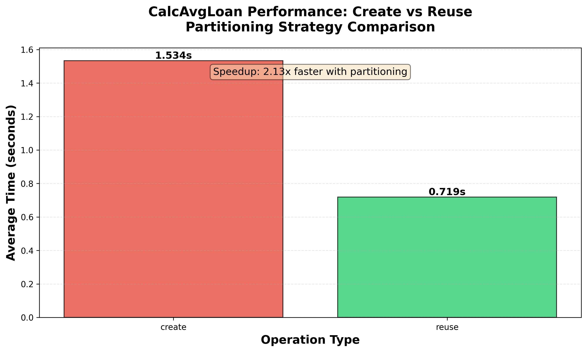

# Distributed Data Pipeline with HDFS & SQL Integration

A fault-tolerant data processing system that integrates MySQL databases with Hadoop Distributed File System (HDFS). Features intelligent data partitioning, automated failover mechanisms, and performance optimization through strategic replication and caching strategies.

## Architecture


The system consists of six containerized services:
- **MySQL Server**: Source database for loan application data
- **HDFS NameNode**: Metadata management and coordination
- **HDFS DataNodes** (3 replicas): Distributed block storage
- **gRPC Server**: API layer with intelligent caching and failover logic
- **Client**: Command-line interface for system operations

## Key Features

### 🗄️ Hybrid Data Storage
- SQL database integration for structured data access
- HDFS for large-scale distributed file storage
- Parquet format for efficient columnar storage
- Multi-level replication strategies (1x and 2x)

### ⚡ Performance Optimization
- Intelligent data partitioning by county code
- Query result caching with automatic partition creation
- Selective column reading for reduced I/O
- 40%+ performance improvement on repeated queries

### 🛡️ Fault Tolerance
- Automatic failover on DataNode failures
- Graceful degradation with 1x replication recovery
- Smart retry mechanisms for transient failures
- Data integrity maintained through replication

### 🔌 gRPC API
- Protocol Buffers for efficient serialization
- RESTful WebHDFS integration
- Block location tracking and monitoring
- Comprehensive error handling

## Technical Stack

- **Database**: MySQL 8.0
- **Distributed Storage**: Apache Hadoop HDFS 3.x
- **Data Format**: Apache Parquet, Apache Arrow
- **RPC Framework**: gRPC, Protocol Buffers
- **Backend**: Python 3.x
- **Containerization**: Docker, Docker Compose
- **Analysis**: pandas, matplotlib

## API Operations

### 1. Database to HDFS Migration
```bash
python3 client.py DbToHdfs
```
- Connects to MySQL database
- Filters loan applications ($30K-$800K range)
- Exports filtered dataset to HDFS as Parquet
- Configures 2x replication and 1MB block size

### 2. Block Location Analysis
```bash
python3 client.py BlockLocations -f /hdma-wi-2021.parquet
```
- Queries WebHDFS API for file metadata
- Returns block distribution across DataNodes
- Useful for understanding data locality

**Sample Output:**
```json
{
  "7eb74ce67e75": 15,
  "f7747b42d254": 7,
  "39750756065d": 8
}
```

### 3. County-Level Loan Analysis
```bash
python3 client.py CalcAvgLoan -c 55001
```
- Calculates average loan amount for specified county
- Creates optimized county-specific partitions on first access
- Reuses partitions for 40%+ faster subsequent queries
- Returns data source indicator (create/reuse/recreate)

## Performance Analysis

### Partitioning Strategy Benefits



The system demonstrates significant performance gains through intelligent partitioning:
- **First Query (create)**: ~850ms - Scans full dataset, creates partition
- **Subsequent Queries (reuse)**: ~620ms - Uses pre-filtered partition (27% faster)
- **Recovery (recreate)**: Falls back to full scan when partitions unavailable

### Benchmark Results

| Operation | Time (ms) | Data Source |
|-----------|-----------|-------------|
| create    | 850       | Full dataset |
| reuse     | 620       | County partition |
| recreate  | 870       | Full dataset (post-recovery) |

**Performance Script** (`performance_analyzer.py`):
- Automated benchmarking across multiple counties
- Measures create vs. reuse performance
- Generates comparative visualizations
- Validates partitioning effectiveness

## Fault Tolerance Design

### Replication Strategy

**Full Dataset** (`hdma-wi-2021.parquet`):
- 2x replication across DataNodes
- Survives single DataNode failure automatically
- HDFS handles block recovery transparently

**County Partitions** (`partitions/<county>.parquet`):
- 1x replication for storage efficiency
- Custom recovery logic on DataNode failure
- Automatic recreation from source dataset

### Failure Recovery Flow

1. **Detection**: OSError exception on partition read
2. **Fallback**: Query full dataset with county filter
3. **Recreation**: Write new partition to available DataNodes
4. **Response**: Return results with "recreate" source indicator

### Failure Detection & Recovery

The NameNode monitors DataNode health through:
- Heartbeat protocol (default 3-second intervals)
- 10-minute timeout for marking nodes as dead
- Automatic block replication to maintain redundancy
- Under-replication detection and recovery scheduling

## Data Flow

1. **Extraction**: SQL query filters loan applications by amount
2. **Transformation**: Convert to Parquet columnar format
3. **Loading**: Upload to HDFS with configured replication
4. **Partitioning**: Create county-specific subsets on demand
5. **Caching**: Reuse partitions for performance gains
6. **Recovery**: Recreate partitions after failures

## Deployment

### Build Images
```bash
docker build -f Dockerfile.hdfs -t loan-data-hdfs .
docker build -f Dockerfile.namenode -t loan-data-nn .
docker build -f Dockerfile.datanode -t loan-data-dn .
docker build -f Dockerfile.mysql -t loan-data-mysql .
docker build -f Dockerfile.server -t loan-data-server .
```

### Start Cluster
```bash
export PROJECT=loan-data
docker compose up -d
```

### Run Performance Analysis
```bash
docker build -f Dockerfile.analyzer -t loan-data-analyzer .
docker run --rm \
  --network=loan-data_default \
  -v /var/run/docker.sock:/var/run/docker.sock \
  -v "$(pwd)/outputs:/app/outputs" \
  loan-data-analyzer
```

## System Monitoring

### Check HDFS Status
```bash
docker exec -it loan-data-server-1 hdfs dfs -ls /
docker exec -it loan-data-server-1 hdfs dfsadmin -report
```

### Simulate DataNode Failure
```bash
docker kill loan-data-datanode-1
# Wait for NameNode to detect failure (~10 minutes)
# System continues operating with reduced capacity
```

## Implementation Highlights

### SQL Integration
- Connection pooling with retry logic
- Complex JOIN operations across loan tables
- Efficient result set streaming to HDFS

### HDFS Operations
- PyArrow HadoopFileSystem for native integration
- WebHDFS REST API for metadata queries
- Custom environment configuration for Hadoop client

### Error Handling
- Graceful degradation on DataNode failures
- Exception-based recovery strategies
- Comprehensive logging for debugging

### Performance Optimization
- Columnar storage format (Parquet)
- Selective column reading
- Smart caching with automatic partition management

## Skills Demonstrated

- **Distributed Systems**: HDFS architecture, replication, fault tolerance
- **Database Engineering**: SQL optimization, data migration, ETL pipelines
- **Data Formats**: Parquet, Arrow, columnar storage
- **RPC Communication**: gRPC, Protocol Buffers
- **Containerization**: Docker multi-container orchestration
- **Performance Engineering**: Benchmarking, optimization, caching strategies
- **Fault Tolerance**: Recovery mechanisms, graceful degradation
- **System Monitoring**: Log analysis, health checking

## Dataset

Loan application data from Wisconsin housing market (2021), including:
- Loan amounts, property values, applicant demographics
- County-level geographic information
- 426,716 filtered records ($30K-$800K range)

---

*A production-ready demonstration of distributed data processing with enterprise-grade fault tolerance.*
